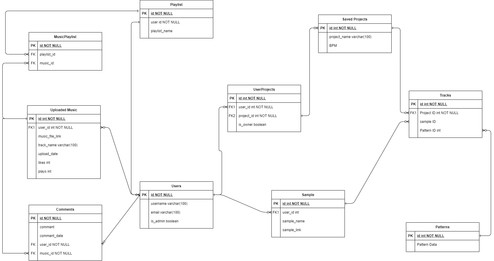

# RevMixer Application by Team RevMixer
The purpose of RevMixer is to allow users to utilize a sequencer to compose, play, and save short looping sections of music.
For musicians, ideas for melodies or musical fragments can pop up out of nowhere. Without an easy and reliable way of recording these sounds,
they can easily be forgotten. Revmixer provides the framework for musicians to express and share their creativity wherever they may be.

# Functionality
* Sequencer dynamically updates based on user input
* BPM slider
* User login
* Ability to save projects
* User can play presets/patetrns
* Ability to export music samples
* A user can upload their music to a central hub
* Ability to view music uploaded by other musicians
* User can upload their own samples
* User can browse a gallery of updated music
* User can add comments to uploaded music
* User can create a playlist and add uploadedmusic to the playlist
* User can share their project with other musicians to collaborate on

# ERD

# Tech Stack
* C#
* Postgresql
* Angular
* Sonar Cloud
* Tone.JS API
* Moq/Xunit
* Serilog
* GCP - APIs and Services
* Amazon S3 Storage Buckets
* Socket.io

# Requirements
- [ ] At least 6 tables
- [ ] DB that is not SQL Server
- [ ] Pipeline should be set up
- [ ] Angular Frontend
- [ ] ASP.NET REST API Backend
- [ ] 50% code coverage in sonar cloud
- [ ] 0% code duplications, A rating on all categories
- [ ] Deployed to an app service(frontend and backend)
- [ ] One repo for each project
- [ ] Authorization should be set up using IDaaS of choosing
- [ ] ProjectName-By-TeamName (add project name in readme)
- [x] Create a project proposal
- [ ] 3rd Part API
- [ ] Logging, testing, ect
- [ ] Implmented SCRUM, have a project board (trello)
